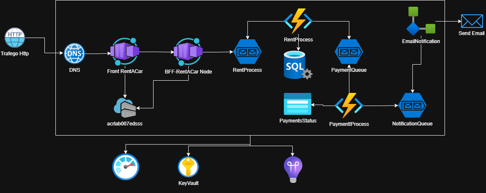

# 🚗 Rent-a-Car - Sistema de Locação de Veículos

## 📖 Sobre o Projeto
O **Rent-a-Car** é um sistema de locação de veículos desenhado com uma arquitetura moderna e orientada a eventos (*Event-Driven Architecture*), alojado totalmente no ecossistema **Microsoft Azure**. 

O projeto divide-se em múltiplos microsserviços, garantindo escalabilidade, resiliência e o desacoplamento das regras de negócio, passando desde a interface do utilizador até ao processamento assíncrono de pagamentos e envio de notificações.

## 🏗️ Arquitetura do Sistema



A solução foi concebida para processar as locações de forma assíncrona. O fluxo de dados segue os seguintes passos:

1.  **Acesso HTTP & DNS:** O tráfego externo é roteado através de um DNS para a nossa aplicação.
2.  **Frontend & BFF (Containers):**
    * O **Front RentACar** consome os serviços do nosso Backend for Frontend (**BFF-RentACar Node**), desenvolvido em Node.js.
    * Ambiente de contentores gerido pelo **Azure Container Apps**, com imagens armazenadas no **Azure Container Registry (ACR)**.
3.  **Processamento de Locação (RentProcess):**
    * O BFF envia o *payload* da requisição para uma fila do **Azure Service Bus** chamada `RentProcess`.
    * Uma **Azure Function (.NET)** consome esta fila, valida a informação, regista os dados na base de dados **Azure SQL** e emite uma nova mensagem para a etapa seguinte.
4.  **Processamento de Pagamento (PaymentQueue):**
    * A mensagem entra na fila `PaymentQueue`.
    * Uma segunda **Azure Function (.NET)**, chamada `PaymenttProcess`, é acionada. Processa a transação e guarda o estado do pagamento no **PaymentsStatus** (Azure Table Storage).
5.  **Notificação (NotificationQueue):**
    * Após o pagamento, um evento é enviado para a `NotificationQueue`.
    * Um fluxo de integração (**EmailNotification** via Azure Logic Apps) consome esta fila e dispara o e-mail de confirmação para o cliente (*Send Email*).

## 🚀 Tecnologias e Serviços Azure Utilizados

* **Frontend:** Aplicação Web alojada em contentores.
* **Backend (BFF):** Node.js / Express.
* **Workers / Background Tasks:** Azure Functions desenvolvidas em **.NET** (`RentProcess` e `PaymenttProcess`).
* **Mensageria:** Azure Service Bus (Filas para Locação, Pagamento e Notificação).
* **Bases de Dados:** Azure SQL (Relacional) e Azure Storage Tables (NoSQL para estado dos pagamentos).
* **Infraestrutura / Contentores:** Azure Container Apps e Azure Container Registry (ACR).
* **Integração:** Azure Logic Apps (Notificações por E-mail).

### 🛡️ Segurança e Monitorização (Serviços Transversais)
Para garantir a integridade e saúde do sistema, a arquitetura conta com pilares de suporte contínuo:
* **Azure Key Vault:** Responsável por armazenar e gerir de forma segura todos os segredos do projeto (Connection Strings do Service Bus, credenciais da Base de Dados, chaves do ACR).
* **Azure Monitor / Application Insights:** Recolha de telemetria, análise de *logs* de desempenho, rastreio distribuído (*distributed tracing*) de mensagens entre microsserviços e alertas de saúde do sistema.

## 🛣️ Endpoints do BFF

### Criar Locação
`POST /api/locacao`

**Corpo da Requisição Esperado (JSON):**
```json
{
    "nome": "string",
    "email": "string",
    "modelo": "string",
    "ano": 2024,
    "tempoAluguel": "string"
}
```

---
*Desenvolvido no âmbito de testes e laboratórios de arquitetura Cloud (Azure).*